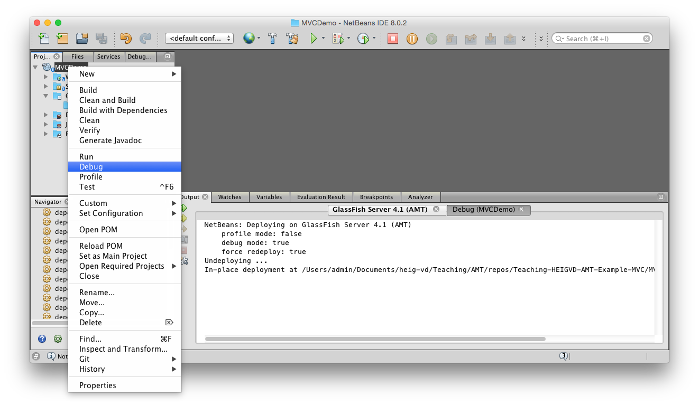
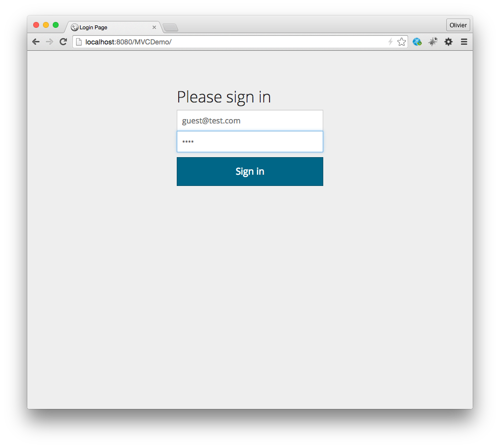
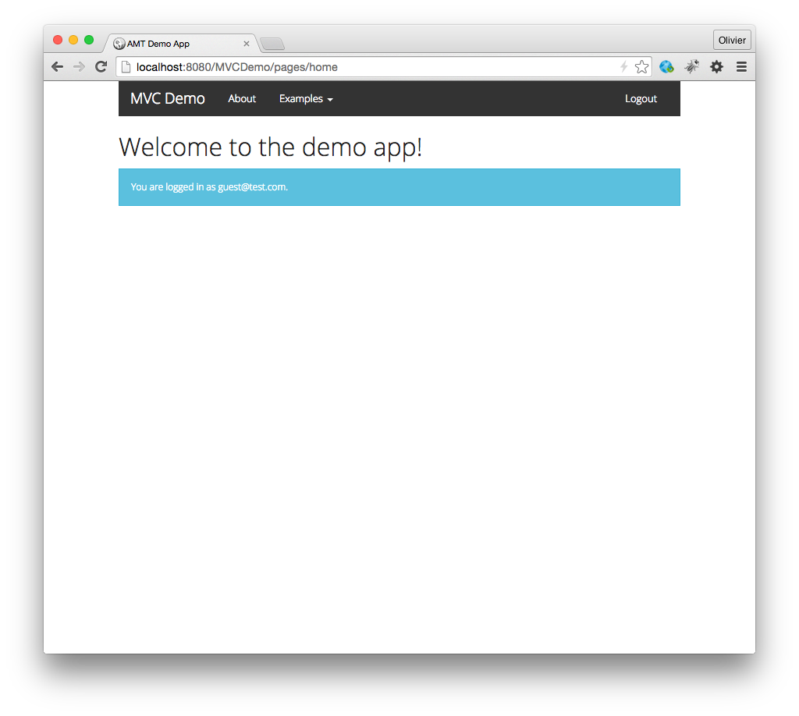
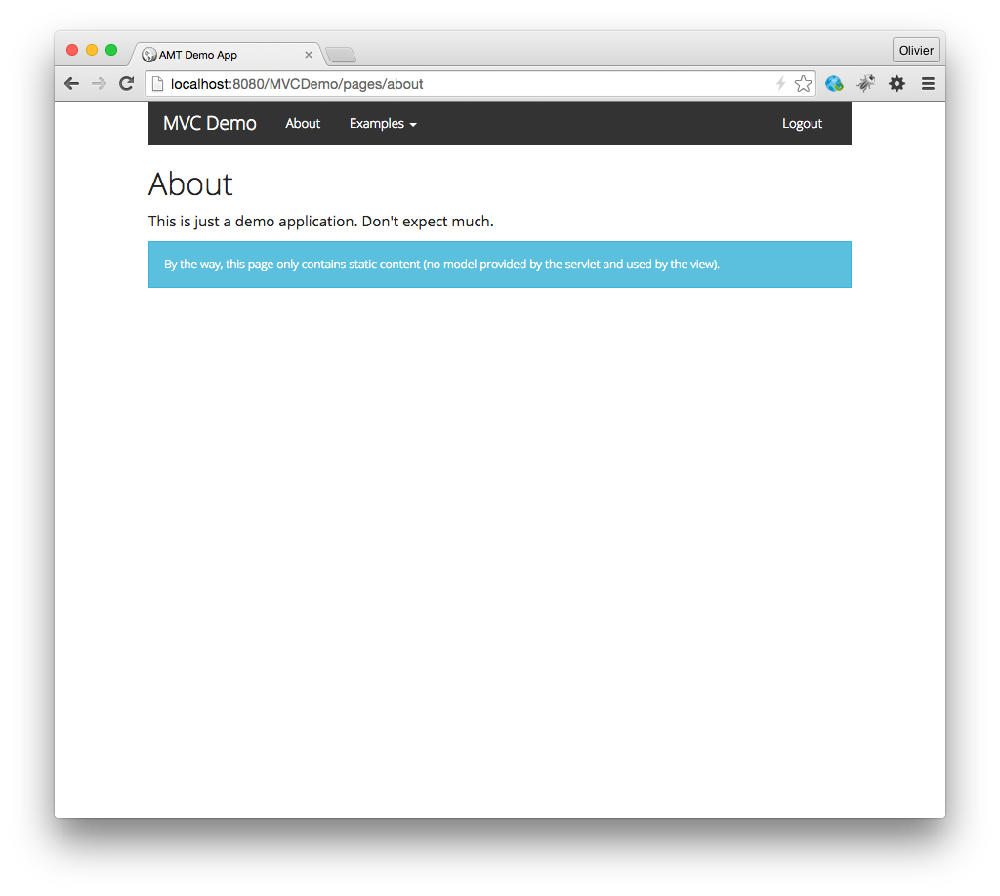
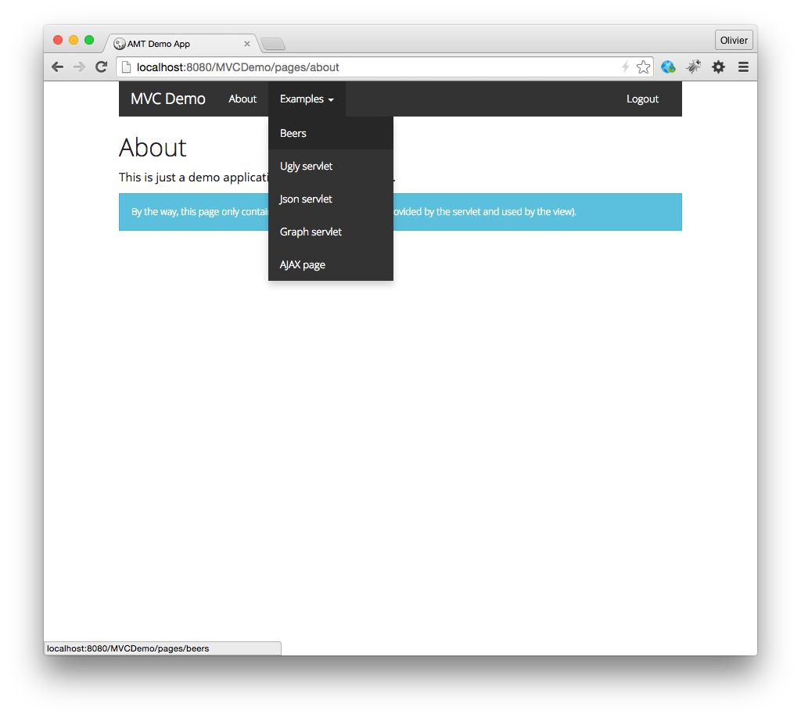
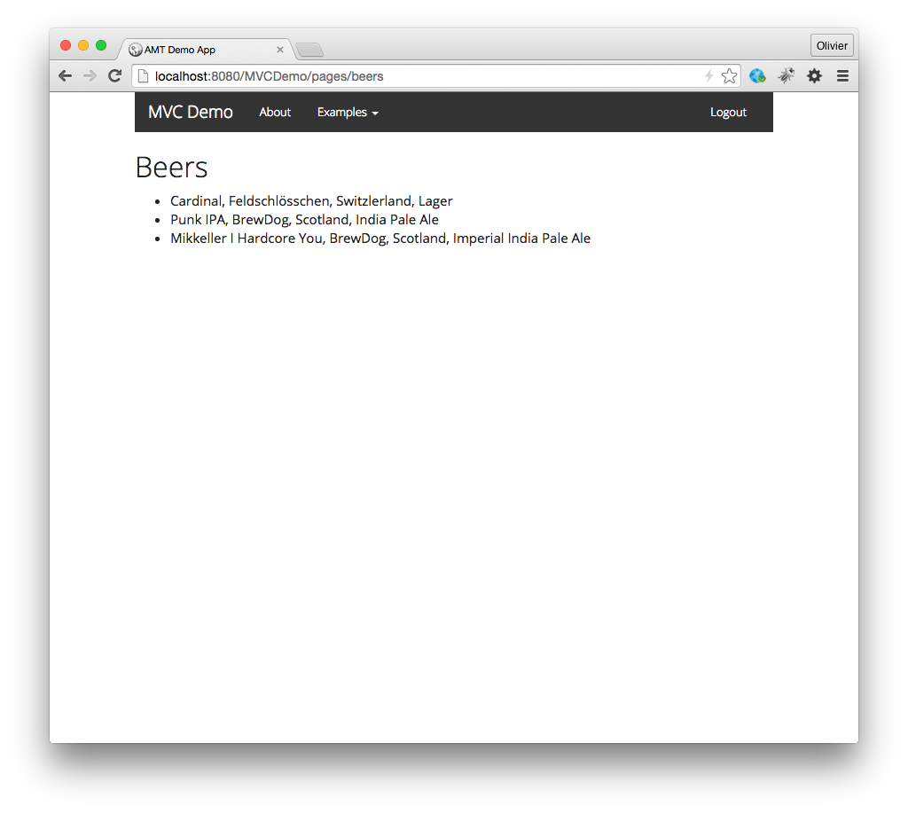
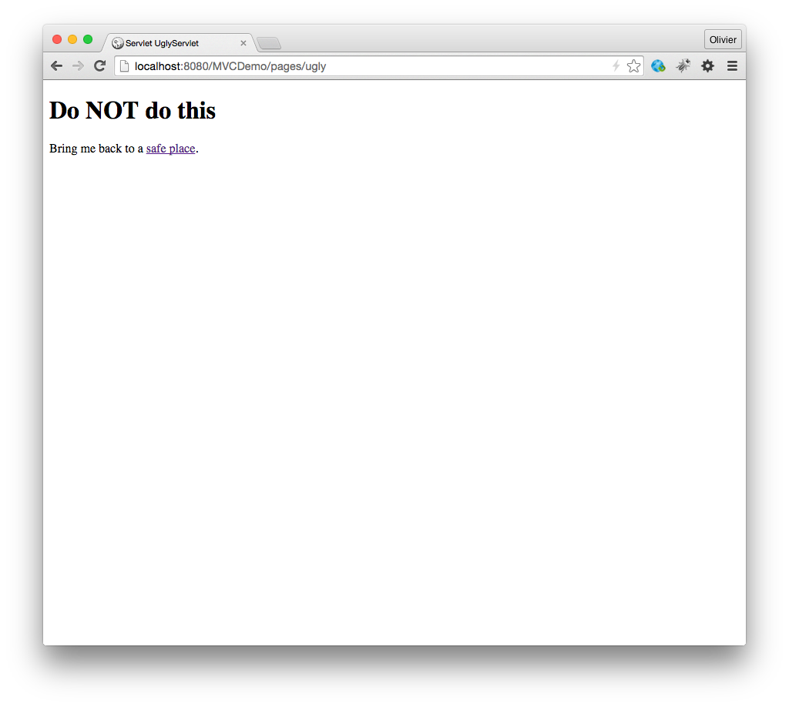
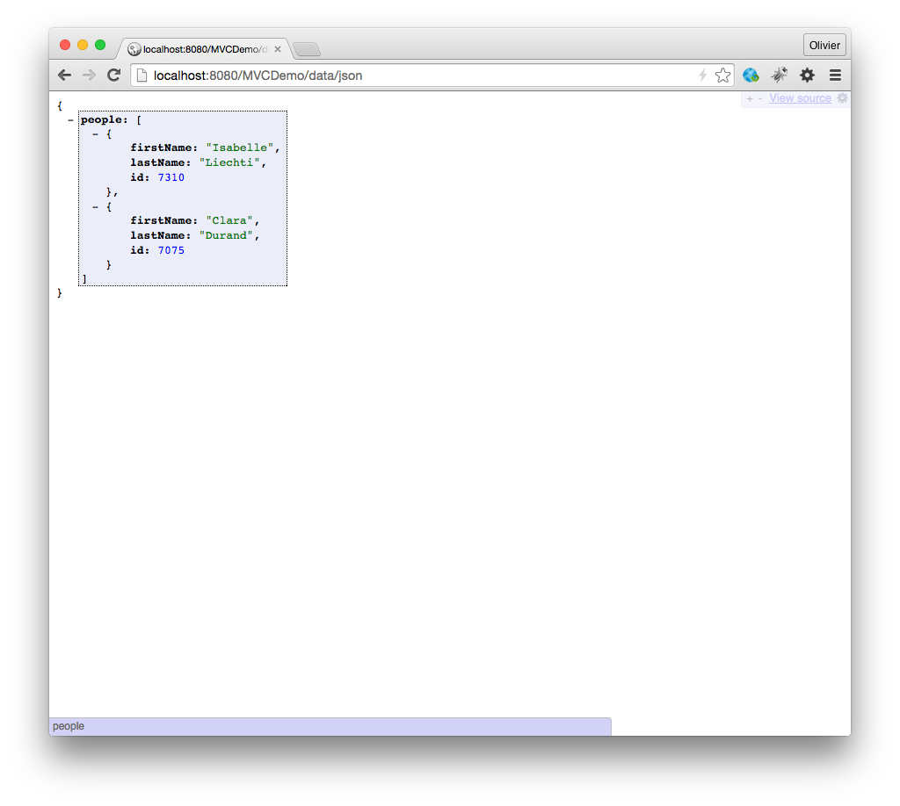
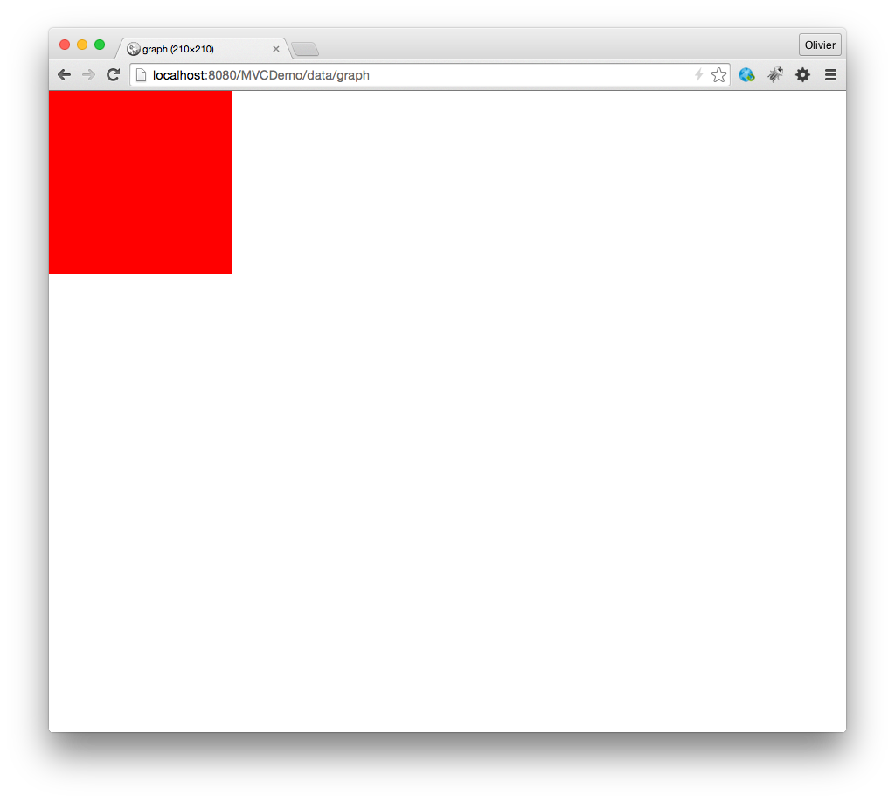
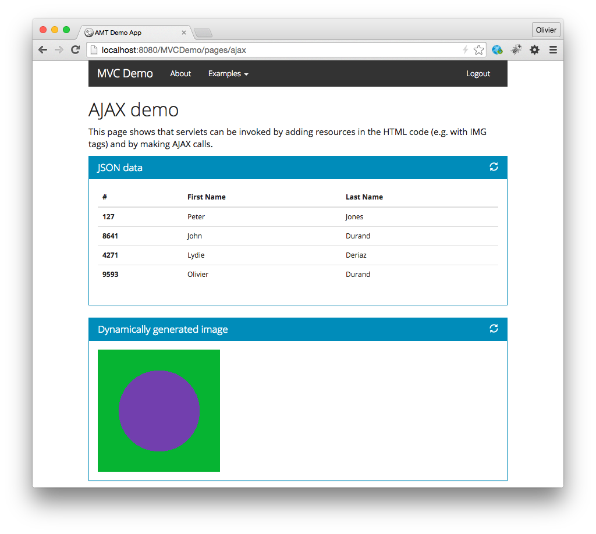

# Teaching-HEIGVD-AMT-Example-MVC

This project is used to illustrate the technologies, techniques and patterns presented in the AMT course at HEIG-VD.

## How to build and run the application

1. Clone this repo.
2. Open the MVCDemo project in Netbeans (assuming that you have installed the Java EE bundle and have a working glassfish domain)
3. Right-click the project, select "Clean and build" (the build process is driven by maven)
4. Right-click the project, select "Debug" (this will start glassfish in debug mode)
5. Access the application at [`http://localhost:8080/MVCDemo/`](http://localhost:8080/MVCDemo)

## What can I do with the application?

The application was developed for illustrative purposes, it does not do anything fancy. The following screenshots give you and idea of what to expect.

This application is really meant to be a sandbox. You should read all classes in the code base (there are not so many). The comments in the code will give you useful information for your project. You should also use the debugger: add breakpoints in the code, navigate to the pages and follow the code execution. You will learn a lot. Last but not least, you can use the application to experiment with the automated testing tools (JMeter, Selenium, etc). When we talk about performance and scalability, you have a system to do experiments.

The application shows that you can protect URLs and require the user to login. The application does not validate passwords: you can enter any email address and any password to get into the site.

## What are all these screens all about?

The application shows how to use Bootstrap templates and how to use a navigation menu. From the navigation menu, you can also logout (technically, this terminates the HTTP session).

The application shows how to implement the MVC design pattern with servlets and JSP pages. In the case of the About page, there is no model prepared by the controller servlet. Notice, however, that the principal (user's email address) is displayed in the view. This information is stored in the HTTP session.

The Bootstrap template that we used also makes it possible to use drop down menus. Each element in the menu will issue a request that will first be intercepted by the Security Filter (which checks if user has been authenticated), then processed by a controller servlet, and finally handled by a JSP page (expect for the JSON and Graph serlvets).

The Beers page shows a typical implementation of the MVC design pattern. The request to `/pages/beers` is routed to the BeersServlet. It invokes a business service, which invokes a data access service and gets a model (a list of beer POJOs). The servlet puts this model in the request scope and delegates rendering of the view to a JSP page. The JSP page retrieves the model and iterates over the list with the Java Standard Tag Library (JSTL).

The ugly servlet shows you what not to do, in other words to generate the HTML markup directly in the servlet. While this is possible, it does not allow you to cleanly separate logic and presentation. The application will be a nightmare to operate (IT staff will hate you) and to maintain (how will you coordinate the activities of developers and UI designers?).

Servlets and JSPs often generate HTML markup, but they can generate other content types. For instance, they can generate JSON payloads.

Similarly, a servlet can generate an image resource representation (in this case, a PNG file). In the code, you will see that a servlet can generate a buffered image with Java2D and generate a binary image in one of the popular formats.

The last page shows how to build AJAX pages. The first controller servlet handles requests to /pages/ajax and delegates rendering of a static page to a JSP page. This page contains Javascript code that will issue asynchronous HTTP requests to /pages/json and /pages/graph, get JSON and PNG content and update the DOM. The Javascript uses the JQuery library for that purpose.

